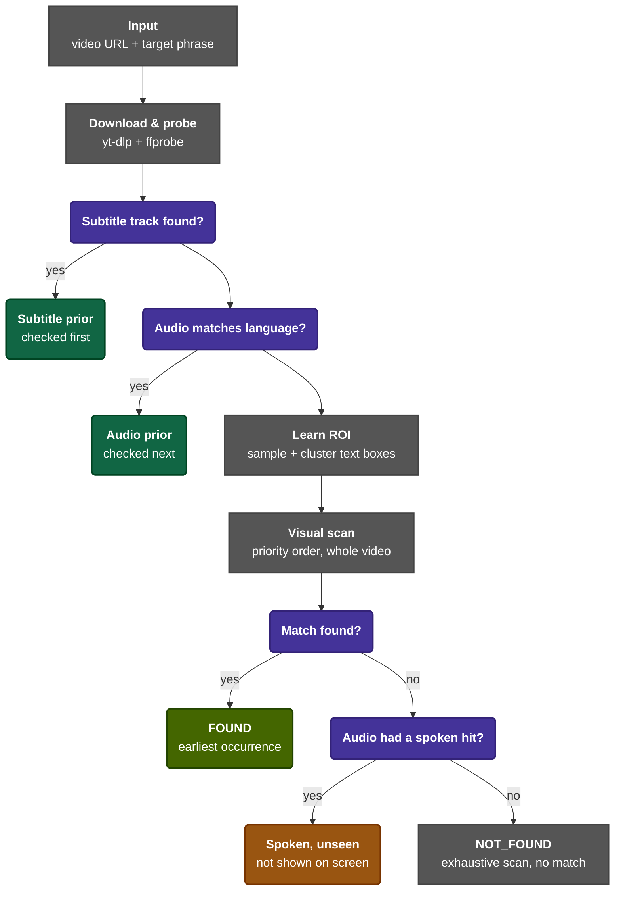

# Assumptions that I Made

There are essentially 2 possible cases, the first case being a video which has subtitles, and the other being one which doesn't have subtitles. In both cases, the overall fundamental approach remains the same as described below.

Another assumption I'm making is that I want to only prioritise correctness of the answers over speed. This means, even with the audio transription being faster, if for any reason, it isn't as effective, we we will still fallback to the video stream.

# My Thought Process

I'll probably process both streams initially, and use a lightweight speech-to-text model (initial research has me going with a model like ```faster-whisper```) for the audio stream. Using the transcript I get from that, I'll probably sync it up with timestamps, in order to get the required prediction and frame, and from there I'll probably use OCR on the video if subtitles are present in the video, although I'm yet to investigate the feasibility of this approach.

There are downsides to this approach, though. One problem is that it isn't necessary that the subtitles will exist only in the bottom 30% of the screen and its location is also subject to change. In addition full-frame OCR is very computationally expensive, and not really the most scalable or best approach. Instead, what I plan to do is to use various levels of sub-sampling at different timestamps in the video, and identify where subtitles are positioned accordingly. Also if the audio stream is corrupted or not really active, it could skew our results.

The main fallback will still be the visual pipeline, though that is more meant to be a last resort than anything else.

# Video Frame Extraction
For downloading the video, I'm planning on using ```yt-dlp``` which has video downloading capabilities on multiple sources apart from Youtube (I have a lot of experience downloading anime with this tool). As for separating the audio and video streams, I'll probably use ```ffmpeg```.

For frame extraction, I'll probably use ```OpenCV``` for extracting an individual frame that's synced to the timestamp, that's required for returning.

# Architecture



# Phase 1: Ingestion pipeline
Initially, I just went with using ```yt-dlp``` for getting the video files and I used ```ffmpeg``` to separate audio stream and the video stream. In addition, I used ```ffprobe``` in order to get associated subtitle files if any. These are generally times-synced and very accurate for the most part.

Apart from facing a couple of SSL issues (broken headers which I fixed by updating ```yt-dlp```), for the most part everything was functioning as intended. I saved the separate streams in the ```/downloads``` directory, for further processing.

# Phase 2: Pipeline Setup
There are 2 main priors as mentioned in the architecture diagram, which get dynamically reordered based on which one is available. In addition, ```roi.py``` looks for where embedded subtitles could be located if present directly in the video file, and returns an area box of where it could be located. The ```prior.py``` file checks both audio and video priors. The ```pipeline.py``` consolidates all the functionality of the above files together to get the final result.
